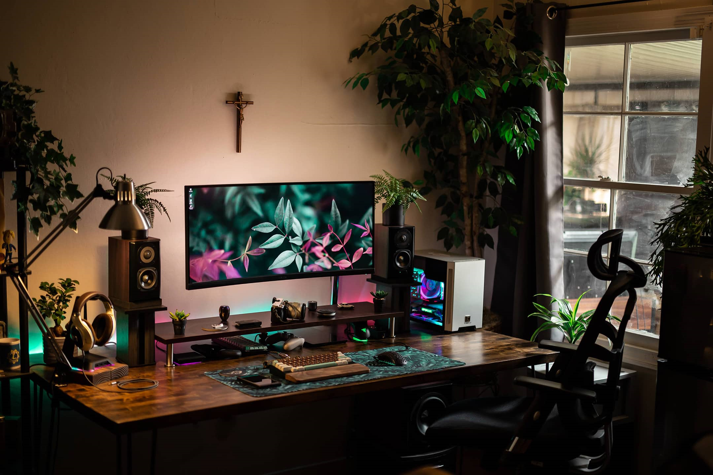

<h2 align='center'> Hello World 👋</h2>

<h2></h2>

  

<h2></h2>

### 👩‍💻 About Me : 

↪🦎 I'm a young brazilian developer. 

↪💻 I’m currently working as an intern dev looking for experience in backend and frontend. 

↪🔱 I try to learn and practice different languages ​​whenever I can.

↪⚡ Fun fact: I started coding when I was 13!

<h2></h2>

### 🛠️ Languages and Tools :

  
  
  
  
  
  
  
  
  
  
  
  
  

<h2></h2>

    

